# PROJECT_LANDKARTE.md

## 1. Projekt-Übersicht

WidgetSystem ist ein modulares, konfigurationsgesteuertes GUI-Framework auf Basis von **Python 3.10+**, **PySide6 (Qt6)** und **Qt Advanced Docking System (QtAds)**. Es nutzt ein Factory-Pattern für UI-Komponenten, JSON-basierte Konfiguration und strikte Trennung von Core, Factories und UI.

**Technologie-Stack:**
- Python 3.10+
- PySide6 (Qt6)
- PySide6-QtAds
- JSON (Konfiguration)
- Factory Pattern

**Haupt-Module:**
- `core/` (MainWindow, ThemeManager, PluginSystem)
- `factories/` (LayoutFactory, ThemeFactory, MenuFactory, ...)
- `ui/` (Panels, Visual Layer, InlayTitleBar, etc.)

---

## 2. Ordner- und Modulstruktur

### Mindmap
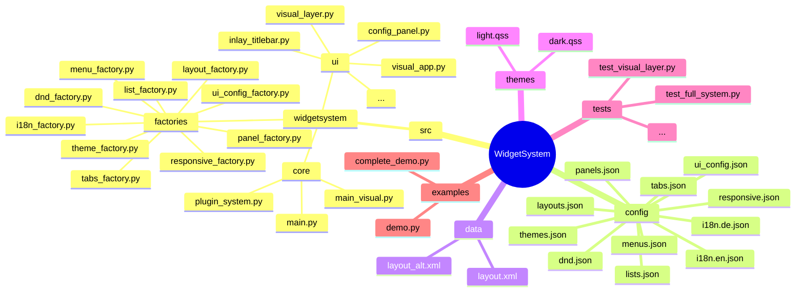

### Modul-Abhängigkeitsgraph
```mermaid
graph TD
  core_main[core/main.py] --> factories_layout[LayoutFactory]
  core_main --> factories_theme[ThemeFactory]
  core_main --> factories_panel[PanelFactory]
  core_main --> factories_menu[MenuFactory]
  core_main --> factories_tabs[TabsFactory]
  core_main --> factories_dnd[DnDFactory]
  core_main --> factories_responsive[ResponsiveFactory]
  core_main --> factories_i18n[I18nFactory]
  core_main --> factories_list[ListFactory]
  core_main --> factories_ui_config[UIConfigFactory]
  core_main --> core_theme[ThemeManager]
  core_main --> core_plugin[PluginManager]
  core_main --> ui_inlay[InlayTitleBarController]
  core_main --> ui_config[ConfigurationPanel]
  factories_layout --> config_layouts[config/layouts.json]
  factories_theme --> config_themes[config/themes.json]
  factories_menu --> config_menus[config/menus.json]
  factories_panel --> config_panels[config/panels.json]
  factories_tabs --> config_tabs[config/tabs.json]
  factories_dnd --> config_dnd[config/dnd.json]
  factories_responsive --> config_responsive[config/responsive.json]
  factories_list --> config_lists[config/lists.json]
  factories_ui_config --> config_ui_config[config/ui_config.json]
  factories_i18n --> config_i18n_de[config/i18n.de.json]
  factories_i18n --> config_i18n_en[config/i18n.en.json]
```

---

## 3. High-Level Architektur
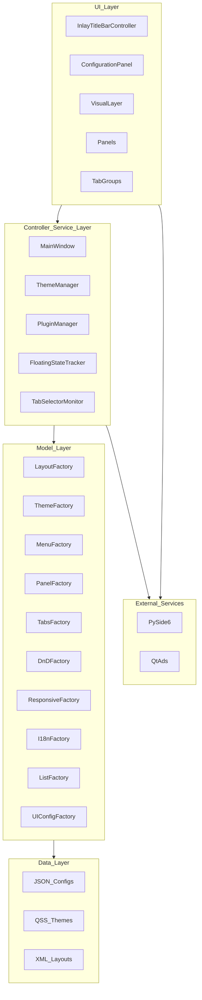

---

## 4. Vollständiges Klassendiagramm
```mermaid
classDiagram
  class MainWindow {
    +LayoutFactory layout_factory
    +ThemeFactory theme_factory
    +PanelFactory panel_factory
    +MenuFactory menu_factory
    +TabsFactory tabs_factory
    +DnDFactory dnd_factory
    +ResponsiveFactory responsive_factory
    +I18nFactory i18n_factory
    +ListFactory list_factory
    +UIConfigFactory ui_config_factory
    +ThemeManager theme_manager
    +PluginManager plugin_manager
    +QToolBar _toolbar
    +InlayTitleBarController _inlay_controller
    +QMainWindow
  }
  MainWindow --|> QMainWindow
  MainWindow o-- LayoutFactory
  MainWindow o-- ThemeFactory
  MainWindow o-- PanelFactory
  MainWindow o-- MenuFactory
  MainWindow o-- TabsFactory
  MainWindow o-- DnDFactory
  MainWindow o-- ResponsiveFactory
  MainWindow o-- I18nFactory
  MainWindow o-- ListFactory
  MainWindow o-- UIConfigFactory
  MainWindow o-- ThemeManager
  MainWindow o-- PluginManager
  MainWindow o-- InlayTitleBarController
  MainWindow o-- QToolBar
  class LayoutFactory {
    +load_layouts()
    +get_default_layout_id()
  }
  class ThemeFactory {
    +load_themes()
    +create_default_profiles()
  }
  class MenuFactory {
    +load_menus()
  }
  class PanelFactory {
    +load_panels()
  }
  class TabsFactory {
    +load_tab_groups()
  }
  class DnDFactory {
    +load_drop_zones()
    +load_dnd_rules()
  }
  class ResponsiveFactory {
    +load_breakpoints()
    +load_responsive_rules()
  }
  class I18nFactory {
    +translate()
  }
  class ListFactory {
    +load_lists()
  }
  class UIConfigFactory {
    +load_ui_config()
  }
  class ThemeManager {
    +themeChanged
    +set_current_theme()
    +theme_names()
    +get_theme()
    +clear()
  }
  class PluginManager {
    +register_factory()
    +load_plugins()
  }
  class InlayTitleBarController {
    +install()
    +set_title()
    +titlebar
  }
  class ConfigurationPanel {
    +show()
  }
  class FloatingStateTracker {
    +track_dock_widget()
    +register_post_refresh_callback()
  }
  class TabSelectorMonitor {}
  class TabSelectorVisibilityController {}
  class TabColorController {}
  MainWindow o-- FloatingStateTracker
  MainWindow o-- TabSelectorMonitor
  MainWindow o-- TabSelectorVisibilityController
  MainWindow o-- TabColorController
```

---

## 5. Modul-Abhängigkeits-Graph
```mermaid
graph TD
  src_widgetsystem_core_main --> src_widgetsystem_factories_layout_factory
  src_widgetsystem_core_main --> src_widgetsystem_factories_theme_factory
  src_widgetsystem_core_main --> src_widgetsystem_factories_panel_factory
  src_widgetsystem_core_main --> src_widgetsystem_factories_menu_factory
  src_widgetsystem_core_main --> src_widgetsystem_factories_tabs_factory
  src_widgetsystem_core_main --> src_widgetsystem_factories_dnd_factory
  src_widgetsystem_core_main --> src_widgetsystem_factories_responsive_factory
  src_widgetsystem_core_main --> src_widgetsystem_factories_i18n_factory
  src_widgetsystem_core_main --> src_widgetsystem_factories_list_factory
  src_widgetsystem_core_main --> src_widgetsystem_factories_ui_config_factory
  src_widgetsystem_core_main --> src_widgetsystem_core_theme_manager
  src_widgetsystem_core_main --> src_widgetsystem_core_plugin_system
  src_widgetsystem_core_main --> src_widgetsystem_ui_inlay_titlebar
  src_widgetsystem_core_main --> src_widgetsystem_ui_config_panel
  src_widgetsystem_factories_layout_factory --> config_layouts_json
  src_widgetsystem_factories_theme_factory --> config_themes_json
  src_widgetsystem_factories_menu_factory --> config_menus_json
  src_widgetsystem_factories_panel_factory --> config_panels_json
  src_widgetsystem_factories_tabs_factory --> config_tabs_json
  src_widgetsystem_factories_dnd_factory --> config_dnd_json
  src_widgetsystem_factories_responsive_factory --> config_responsive_json
  src_widgetsystem_factories_list_factory --> config_lists_json
  src_widgetsystem_factories_ui_config_factory --> config_ui_config_json
  src_widgetsystem_factories_i18n_factory --> config_i18n_de_json
  src_widgetsystem_factories_i18n_factory --> config_i18n_en_json
```

---

## 6. Signal / Slot Landkarte

### Sequence Diagram: Layout speichern
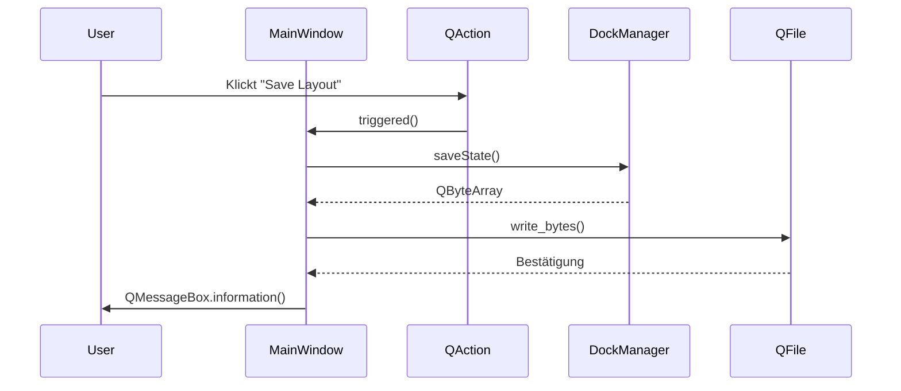

### Sequence Diagram: Theme-Wechsel
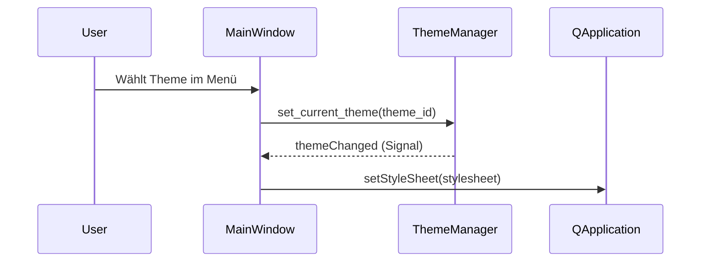

### Flowchart: Panel Drag & Drop
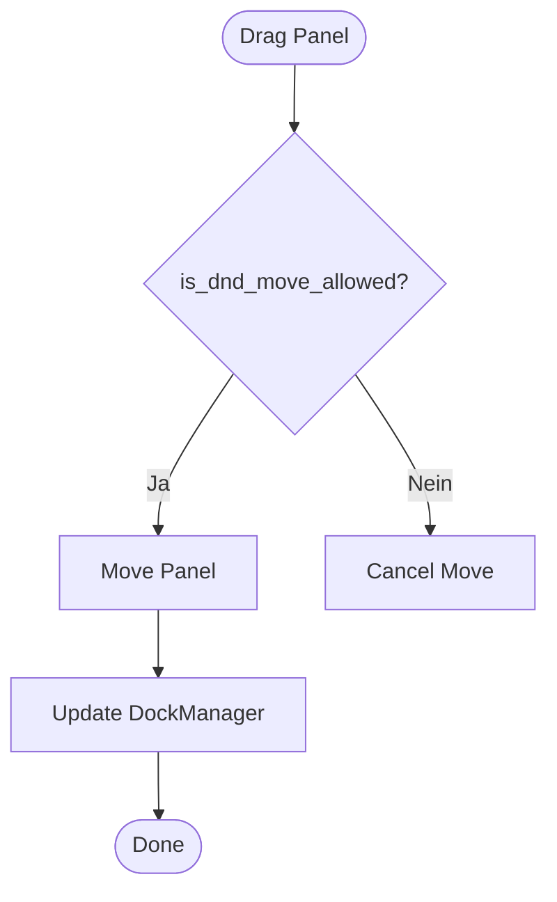

### Sequence Diagram: Responsive Breakpoint
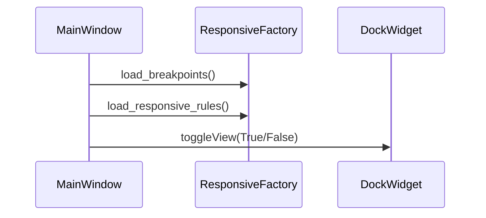

### Sequence Diagram: Plugin-Registrierung
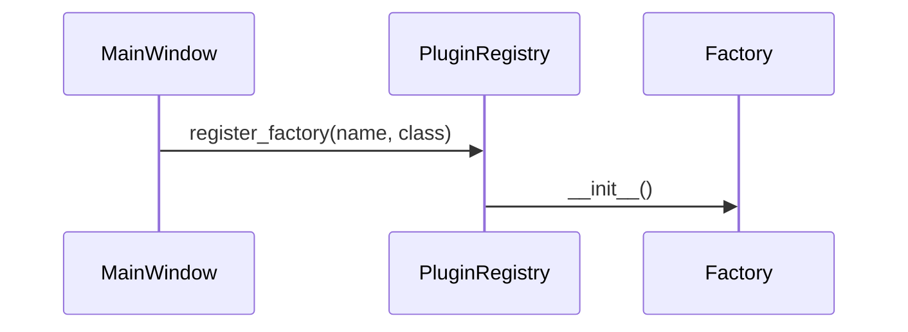

---

## 7. Datenfluss-Diagramm
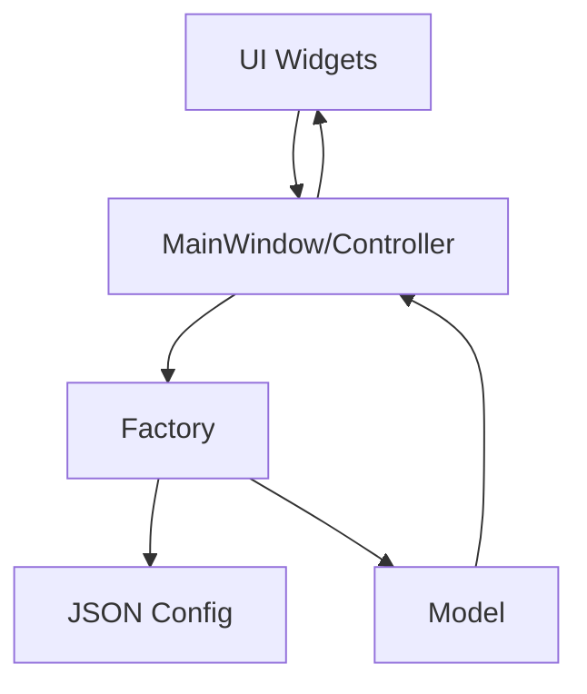

---

## 8. State Machine
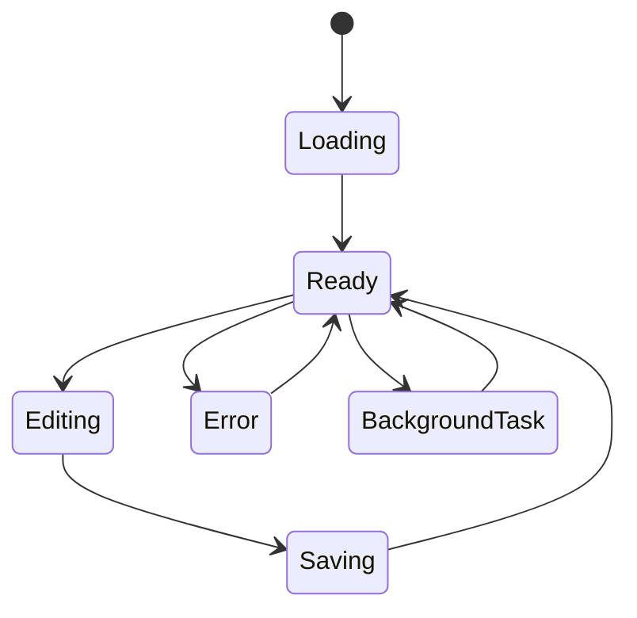

---

## 9. Zusammenhänge & Verbindungen Übersicht
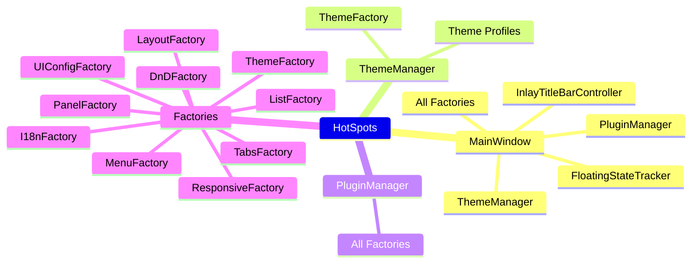

---

## 10. Zusammenfassung & Verbesserungsvorschläge

**Stärken:**
- Klare Trennung von Core, Factories und UI
- Konfigurationsgetriebenes Design (leicht erweiterbar)
- Factory-Pattern für alle UI-Komponenten
- Gute Testbarkeit durch lose Kopplung
- Moderne Python- und Qt-Architektur

**Schwächen:**
- MainWindow ist sehr zentral und "God Object"-ähnlich
- Viele Factories werden direkt im MainWindow gehalten (hohe Kopplung)
- Signal/Slot-Verbindungen sind teilweise implizit und schwer nachzuverfolgen
- Komplexität der DockManager-Integration

**Refactoring-Tipps:**
- Factories über Dependency Injection oder Service Locator entkoppeln
- MainWindow in kleinere Controller/Manager aufteilen
- Signal/Slot-Flows expliziter dokumentieren (ggf. eigene Signal-Registry)
- UI-Logik weiter von Core trennen (z.B. Presenter/MVVM)

**Performance-Hinweise für PySide6:**
- Signals/Slots: Möglichst wenig im UI-Thread blockieren
- Für lange Tasks QThread/QFuture verwenden
- Models (z.B. QAbstractTableModel) für große Datenmengen nutzen
- QSS-Stylesheets nicht zu oft neu setzen (Performance)
- DockManager-Operationen bündeln, nicht zu häufig aufrufen

---

*Diese Landkarte wurde automatisch aus dem aktuellen Stand der Codebase generiert. Für Details siehe die jeweiligen Module und Factory-Implementierungen.*
